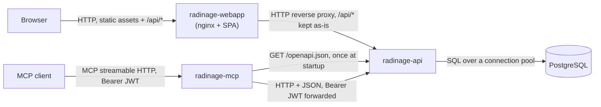
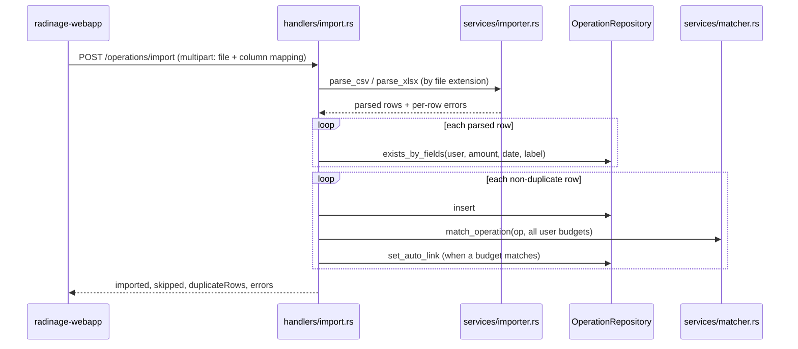

# Architecture

How Radinage is put together and why. Commands, configuration and deployment
steps live in the [README](README.md); contributor tooling lives in
[CONTRIBUTING.md](CONTRIBUTING.md).

## Overview

Radinage is three processes in front of one PostgreSQL database. The REST API
owns every rule and every byte of data; the web app and the MCP server are two
clients of that API, one for humans in a browser and one for AI assistants.
Neither client talks to the database, and neither holds business logic the API
does not enforce.

## Components

**[radinage-api/](radinage-api/)**: Axum service exposing the REST API and its
OpenAPI document (`/openapi.json`, rendered at `/docs`). Layered as
handler → service → repository → database:

- [src/handlers/](radinage-api/src/handlers/) parse requests, check the caller
  through the `AuthUser` extractor and map domain values to `*Response` DTOs.
- [src/services/](radinage-api/src/services/) hold the logic that is not
  persistence: [matcher.rs](radinage-api/src/services/matcher.rs) picks the
  budget an operation belongs to, [importer.rs](radinage-api/src/services/importer.rs)
  turns a CSV or XLSX file into rows. Both are pure functions over domain
  values, with no I/O.
- [src/repositories/](radinage-api/src/repositories/) define one trait per
  aggregate (`UserRepository`, `OperationRepository`, `BudgetRepository`), each
  with a `Pg*` implementation and a mockall-generated mock for handler tests.
- [src/domain/](radinage-api/src/domain/) holds users, operations and budgets,
  including the `BudgetLink` and `BudgetKind` enums that carry most of the
  domain's shape.
- [src/auth/](radinage-api/src/auth/) hashes passwords with Argon2 and issues
  and verifies HS256 JWTs carrying the user id and role.
- [src/error.rs](radinage-api/src/error.rs) maps `AppError` to a status code and
  a `{"error": ...}` body; a database error is logged and returned as a
  generic 500 so SQL details never reach the client.

At startup it applies pending migrations, seeds the admin account if missing,
then serves. It does not serve the web app and does not talk to the MCP
server.

**[radinage-mcp/](radinage-mcp/)**: MCP server over streamable HTTP. At
startup it fetches the API's OpenAPI document and turns each operation into an
MCP tool ([src/openapi.rs](radinage-mcp/src/openapi.rs)), skipping the
login, activation and file-import operations. A tool call
([src/server.rs](radinage-mcp/src/server.rs)) becomes one HTTP request to the
API with the client's `Authorization` header forwarded unchanged. It holds no
credentials, no data and no rules of its own.

**[radinage-webapp/](radinage-webapp/)**: React SPA. File-based routes in
[src/routes/](radinage-webapp/src/routes/); every server call goes through
[src/lib/api.ts](radinage-webapp/src/lib/api.ts), which prefixes `/api`,
attaches the token and logs the user out on a 401. TanStack Query holds server
state; Zustand holds the client-only session in
[src/stores/](radinage-webapp/src/stores/). Colours come from the Mantine theme
in [src/theme.ts](radinage-webapp/src/theme.ts), and
[src/lib/tones.ts](radinage-webapp/src/lib/tones.ts) maps each budget type to
one palette colour so income, expense and savings read the same everywhere.

**Packaging**: the [Dockerfile](Dockerfile) builds three images from one
build graph, each running as UID/GID 65532:

| Target   | Contains                                                                    |
| -------- | --------------------------------------------------------------------------- |
| `api`    | the `radinage-api` binary (musl) on Alpine                             |
| `mcp`    | the `radinage-mcp` binary (musl) on Alpine                             |
| `webapp` | the built SPA served by unprivileged nginx ([nginx.conf](nginx.conf), [default.conf.template](default.conf.template)) |

The [Helm chart](helm/radinage/) deploys the three as separate Deployments,
each with its own Service, ServiceAccount and optional HPA, behind one Ingress
that routes by path prefix. PostgreSQL is outside the chart: the API reads its
connection string from an existing Secret.
[docker-compose.yaml](docker-compose.yaml) wires the same three images to a
local PostgreSQL.

## Data flow

**An authenticated request.** The SPA sends `/api/...` with
`Authorization: Bearer <jwt>`. nginx forwards it unchanged to the API, whose
router is nested under its root path. The `AuthUser` extractor validates the
signature and expiry and yields the user id and role; no database lookup is
involved. The handler passes that user id to every operation and budget
lookup, which filters on it in SQL, so another user's row is
indistinguishable from a missing one (404). The domain value is converted to a `*Response` DTO
before serialisation.

**A bank-statement import with auto-categorisation.**

Duplicates are checked against the database as it was before the import, so
identical rows inside one file are all kept. A row that fails to parse or
insert is reported and does not abort the others; a matching failure is
ignored and leaves the operation unlinked. The matcher returns the first
budget whose period covers the operation's accounting date (its effective date
if set, otherwise its date) and whose rule matches the label by prefix, suffix
or substring, optionally also requiring the amount to equal the period's
amount. Applying a budget's rules later (`POST /budgets/{id}/apply`) runs the
same matcher over all of the user's operations.

**An MCP tool call.** The MCP client sends a tool call with its own JWT; the
server rebuilds the path, query string and JSON body from the tool arguments,
calls the API, and returns the response body as text, or an error result
carrying the API's status and body.

## State and persistence

PostgreSQL is the only store, owned exclusively by `radinage-api`. Users own
operations and budgets; budgets own their periods and matching rules; deleting
a user or a budget cascades through foreign keys. An operation's budget link is
two columns (link type and budget id) that encode `BudgetLink`: unlinked,
manual, or auto. The schema is defined by
[radinage-api/migrations/](radinage-api/migrations/).

The API process is otherwise stateless: no session table, no cache. The MCP
server keeps only its tool list and per-connection MCP session state in
memory. The browser keeps the JWT and role in `localStorage`.

## Design decisions

**Static dispatch over repository traits.** `AppState<U, O, B>` is generic
over the three repository types and handlers are generic functions. Tests swap
in mocks with no `dyn` and no runtime cost, at the price of generic parameters
on every handler signature.

**Runtime SQL, not compile-time-checked macros.** Queries use `sqlx::query()`
so building the crate never needs a reachable database or an offline query
cache. Column and type mistakes surface in the repository tests against a real
PostgreSQL instead of at compile time.

**Response DTOs per handler.** Domain structs carry `user_id`; handlers return
a dedicated `*Response` type that omits it. This keeps the internal ownership
key out of the public contract and lets the domain evolve without changing the
JSON.

**Stateless JWT.** Authentication needs no database round-trip and works the
same behind any number of API replicas. The trade-off is that a token stays
valid until it expires: role changes, password resets and user deletion do not
revoke tokens already issued.

**The MCP surface is derived, not written.** Tools come from the OpenAPI
document the API generates from its own routes, so a new endpoint becomes a
tool without touching `radinage-mcp`. The cost is that tool quality depends on
the summaries and descriptions written in the API's route definitions, and the
tool list is frozen at MCP startup.

**Same-origin web app.** nginx serves the SPA and proxies `/api/` on the same
origin, so the browser needs no CORS and the API address is a deployment
setting of the web app image rather than a build-time constant.

**Configuration through clap.** Every setting of both Rust binaries is a
`#[arg(long, env = ...)]` field in their `config.rs`, giving one typed place
that defines flags, environment variables and defaults together.

## Invariants and constraints

- **Applied migrations are immutable.** `sqlx::migrate!` embeds the migration
  files into the binary and records each one's checksum in the database; the
  API refuses to start when an applied migration's file no longer matches. A
  schema change is always a new, higher-numbered file.
- **Every operation and budget lookup is scoped by the caller's user id.**
  Ownership is enforced in SQL; the few repository methods that take only a
  row id (such as `set_auto_link`) are called on rows already loaded that
  way.
- **No response exposes `user_id`.**
- **A manual budget link is never overwritten by auto-matching**; only an
  explicit `force` on apply replaces it.
- **Recurring budget periods never overlap**, checked by
  `BudgetKind::validate_no_overlap` before writing.
- **The SPA always calls `/api`.** Whatever sits in front of the API must
  either strip that prefix or forward it to an API whose root path is `api`.
- **The MCP server's API URL includes the API's root path**, since it fetches
  `<url>/openapi.json` and builds tool URLs by appending operation paths.
- **The API must be reachable when `radinage-mcp` starts**: it exits if the
  OpenAPI document cannot be fetched.
- **All three images run as UID/GID 65532** and never as root.

## Limitations

- Multi-statement writes are not transactional: a budget with its periods and
  rules, an import, and a data import each run as independent statements, so a
  failure midway leaves the rows already written.
- Imports run one duplicate-check query per row and one budget listing per
  inserted row; large statements are slow rather than failing.
- Duplicate detection is exact on (date, amount, label); two genuinely
  distinct operations sharing all three are treated as one.
- The MCP server does not expose file import, login or account activation; a
  client needs a JWT obtained elsewhere.
- Tokens cannot be revoked before expiry.
