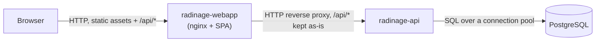
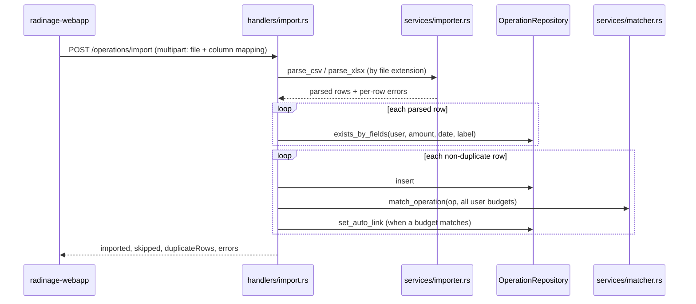

# Architecture

How Radinage is put together and why. Commands, configuration and deployment
steps live in the [README](README.md); contributor tooling lives in
[CONTRIBUTING.md](CONTRIBUTING.md).

## Overview

Radinage is two processes in front of one PostgreSQL database. The REST API
owns every rule and every byte of data; the web app is its client, for humans
in a browser. The web app never talks to the database and holds no business
logic the API does not enforce. Decisions that reshaped the system are recorded
in [docs/adr/](docs/adr/).

## Components

**[radinage-api/](radinage-api/)**: Axum service exposing the REST API and its
OpenAPI document (`/openapi.json`, rendered at `/docs`). Layered as
handler → service → repository → database:

- [src/handlers/](radinage-api/src/handlers/) parse requests, check the caller
  through the `AuthUser` extractor and map domain values to `*Response` DTOs.
- [src/services/](radinage-api/src/services/) hold the logic that is not
  persistence: [matcher.rs](radinage-api/src/services/matcher.rs) picks the
  budget an operation belongs to, [importer.rs](radinage-api/src/services/importer.rs)
  turns a CSV or XLSX file into rows, and
  [forecast.rs](radinage-api/src/services/forecast.rs) projects the
  month-by-month balance behind `GET /forecast`. All are pure functions over
  domain values, with no I/O.
- [src/repositories/](radinage-api/src/repositories/) define one trait per
  aggregate (`UserRepository`, `OperationRepository`, `BudgetRepository`), each
  with a `Pg*` implementation and a mockall-generated mock for handler tests.
- [src/domain/](radinage-api/src/domain/) holds users, operations and budgets,
  including the `BudgetLink` and `BudgetKind` enums that carry most of the
  domain's shape.
- [src/auth/](radinage-api/src/auth/) hashes passwords with Argon2 and issues
  and verifies HS256 JWTs carrying the user id and role.
- [src/error.rs](radinage-api/src/error.rs) maps `AppError` to a status code and
  a `{"error": ...}` body; a database error is logged and returned as a
  generic 500 so SQL details never reach the client.

At startup it applies pending migrations, seeds the admin account if missing,
then serves. It does not serve the web app.

**[radinage-webapp/](radinage-webapp/)**: React SPA. File-based routes in
[src/routes/](radinage-webapp/src/routes/); every server call goes through
[src/lib/api.ts](radinage-webapp/src/lib/api.ts), which prefixes `/api`,
attaches the token and logs the user out on a 401. TanStack Query holds server
state; Zustand holds the client-only session in
[src/stores/](radinage-webapp/src/stores/). Colours come from the Mantine theme
in [src/theme.ts](radinage-webapp/src/theme.ts), and
[src/lib/tones.ts](radinage-webapp/src/lib/tones.ts) maps each budget type to
one palette colour so income, expense and savings read the same everywhere.

**Packaging**: the [Dockerfile](Dockerfile) builds two images from one
build graph, each running as UID/GID 65532:

| Target   | Contains                                                                    |
| -------- | --------------------------------------------------------------------------- |
| `api`    | the `radinage-api` binary (musl) on Alpine                             |
| `webapp` | the built SPA served by unprivileged nginx ([nginx.conf](nginx.conf), [default.conf.template](default.conf.template)) |

The [Helm chart](helm/radinage/) deploys the two as separate Deployments,
each with its own Service, ServiceAccount and optional HPA, behind one Ingress
that routes by path prefix. PostgreSQL is outside the chart: the API reads its
connection string from an existing Secret.
[docker-compose.yaml](docker-compose.yaml) wires the same two images to a
local PostgreSQL.

## Data flow

**An authenticated request.** The SPA sends `/api/...` with
`Authorization: Bearer <jwt>`. nginx forwards it unchanged to the API, whose
router is nested under its root path. The `AuthUser` extractor validates the
signature and expiry and yields the user id and role; no database lookup is
involved. The handler passes that user id to every operation and budget
lookup, which filters on it in SQL, so another user's row is
indistinguishable from a missing one (404). The domain value is converted to a `*Response` DTO
before serialisation.

**A bank-statement import with auto-categorisation.**

Duplicates are checked against the database as it was before the import, so
identical rows inside one file are all kept. A row that fails to parse or
insert is reported and does not abort the others; a matching failure is
ignored and leaves the operation unlinked. The matcher returns the first
budget whose period covers the operation's accounting date (its effective date
if set, otherwise its date) and whose rule matches the label by prefix, suffix
or substring, optionally also requiring the amount to equal the period's
amount. Applying a budget's rules later (`POST /budgets/{id}/apply`) runs the
same matcher over all of the user's operations.

## State and persistence

PostgreSQL is the only store, owned exclusively by `radinage-api`. Users own
operations and budgets; budgets own their periods and matching rules; deleting
a user or a budget cascades through foreign keys. An operation's budget link is
two columns (link type and budget id) that encode `BudgetLink`: unlinked,
manual, or auto. An operation can instead be split: `operation_splits` holds
its ordered parts, each with an amount and an optional budget that becomes
null when that budget is deleted. A split operation's own link stays unlinked,
and every aggregation counts its parts instead of its amount. The schema is
defined by
[radinage-api/migrations/](radinage-api/migrations/).

The API process is otherwise stateless: no session table, no cache. The
browser keeps the JWT and role in `localStorage`.

## Design decisions

**Static dispatch over repository traits.** `AppState<U, O, B>` is generic
over the three repository types and handlers are generic functions. Tests swap
in mocks with no `dyn` and no runtime cost, at the price of generic parameters
on every handler signature.

**Runtime SQL, not compile-time-checked macros.** Queries use `sqlx::query()`
so building the crate never needs a reachable database or an offline query
cache. Column and type mistakes surface in the repository tests against a real
PostgreSQL instead of at compile time.

**Response DTOs per handler.** Domain structs carry `user_id`; handlers return
a dedicated `*Response` type that omits it. This keeps the internal ownership
key out of the public contract and lets the domain evolve without changing the
JSON.

**Stateless JWT.** Authentication needs no database round-trip and works the
same behind any number of API replicas. The trade-off is that a token stays
valid until it expires: role changes, password resets and user deletion do not
revoke tokens already issued.

**A split keeps the bank operation.** Parts live beside the operation instead
of replacing it with several operations, so the imported row still exists for
duplicate detection on re-import and removing a split loses nothing. The cost
is that every aggregation expands split operations into their parts:
`list_for_summary` in SQL (which feeds both `/summary` and `/forecast`), and
[operation-parts.ts](radinage-webapp/src/lib/operation-parts.ts) in the web app.

**The forecast is computed by the API.** `GET /forecast` returns, for each
month of a horizon of up to 24 months, income, expenses, savings, balance and
running balance. Past months come from the operations accounted so far, later
months from the amounts the budgets expect
(`BudgetKind::expected_amount_for_month`). The current month takes its
operations so far plus, for each budget, the part of its expected amount not
reached yet in the budget's direction (an expense budget of −550 with −330
linked still commits −220; one already exceeded commits nothing; an income not
yet received commits all of it); that sum is exposed as the month's
`committed`, so the month reads as what it will end at rather than what it is
at today. Spending outside any budget is forecast too, at `unbudgetedRate`:
the negative unbudgeted operations of the three complete months before the
current one, divided by the days of those months. It covers the days after
today in the current month and every day of a future month, and is exposed
per month as `unbudgetedForecast` (part of `expenses`). Days without
operations count as zero, so a short history lowers the rate rather than
extrapolating from a few weeks, and unbudgeted income never offsets it. The
window is anchored on today, not on the horizon, so every horizon and the
operations page, which shows `unbudgetedRate` × the days of the month as the
daily operations' forecast, use the same rate. Budget-linked amounts count under
their budget's type; an operation outside any budget counts as income or as an
expense by its own sign, so a salary and a grocery run in the same month never
cancel each other out. The running balance starts at zero before the first
month. Keeping this in the API gives a single, tested
definition of the numbers; the web app only derives presentation values from
it, such as the daily budget.

**Same-origin web app.** nginx serves the SPA and proxies `/api/` on the same
origin, so the browser needs no CORS and the API address is a deployment
setting of the web app image rather than a build-time constant.

**Configuration through clap.** Every setting of both Rust binaries is a
`#[arg(long, env = ...)]` field in their `config.rs`, giving one typed place
that defines flags, environment variables and defaults together.

## Invariants and constraints

- **Applied migrations are immutable.** `sqlx::migrate!` embeds the migration
  files into the binary and records each one's checksum in the database; the
  API refuses to start when an applied migration's file no longer matches. A
  schema change is always a new, higher-numbered file.
- **Every operation and budget lookup is scoped by the caller's user id.**
  Ownership is enforced in SQL; the few repository methods that take only a
  row id (such as `set_auto_link`) are called on rows already loaded that
  way.
- **No response exposes `user_id`.**
- **A manual budget link is never overwritten by auto-matching**; only an
  explicit `force` on apply replaces it.
- **A split operation's parts sum exactly to its amount**, share its sign and
  number at least two (`validate_splits`). While split, its amount cannot
  change, and neither auto-matching nor a manual link touches it.
- **Recurring budget periods never overlap**, checked by
  `BudgetKind::validate_no_overlap` before writing.
- **The SPA always calls `/api`.** Whatever sits in front of the API must
  either strip that prefix or forward it to an API whose root path is `api`.
- **Both images run as UID/GID 65532** and never as root.

## Limitations

- Multi-statement writes are not transactional: a budget with its periods and
  rules, an import, and a data import each run as independent statements, so a
  failure midway leaves the rows already written.
- Imports run one duplicate-check query per row and one budget listing per
  inserted row; large statements are slow rather than failing.
- Duplicate detection is exact on (date, amount, label); two genuinely
  distinct operations sharing all three are treated as one.
- Tokens cannot be revoked before expiry.
